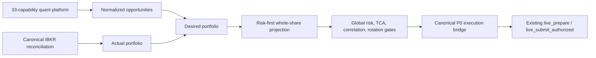

# P2 Production Quant Portfolio Orchestrator

P2 turns the existing 33-capability quant platform into a production-shaped
portfolio decision loop. It does not add a capability and it does not replace
the P0 broker, risk, ledger, approval, reconciliation, or writer controls.



The current default is `AUTONOMOUS_DRY_RUN`. In this mode the same target,
integer projection, gate, and bridge logic runs, but the bridge never invokes
the canonical prepare or submit functions. Broker write count is structurally
zero.

`AUTONOMOUS_BOUNDED` is the desired later operating mode. It has no per-trade
human approval, but it is not active. Activation is a separate controlled
transition and may occur only after P0/P0.2 integrity, reconciliation, writer,
kill-switch, strategy identity/authority, dry-run, and capital-policy gates are
GO. Capital authority and risk limits never promote automatically.

## Portfolio truths

- Actual positions, open orders, executions, commissions, and account values
  come only from canonical IBKR reconciliation.
- Desired continuous weights come from the existing active portfolio manager.
- Executable quantities come only from the existing risk-first whole-share
  sizing output.
- Cash competes as a first-class asset.
- All risky actions pass global risk, correlation/ETF look-through,
  concentration, liquidity, TCA, expected-net-edge, event, daily-loss,
  drawdown, Shariah, freshness, and exact strategy-authority gates.
- Risk reductions are evaluated before risk increases.
- ML return prediction, meta-labeling, mixture-of-experts, reinforcement
  learning, and other insufficiently evidenced models remain shadow-only.

## Runtime

One bounded dry-run cycle:

```powershell
$env:PYTHONPATH='src'
.\.venv-ibkr\Scripts\python.exe -m stocks.portfolio.orchestrator `
  --project-root . --cycles 1 --interval-seconds 0 --network-probe
```

Refresh the existing decision layer first by adding `--refresh`. This remains
broker-write-free, but may update local research/portfolio artifacts.

Verify the frozen P2 integration:

```powershell
$env:PYTHONPATH='src'
.\.venv-ibkr\Scripts\python.exe -m stocks.portfolio.orchestrator `
  --project-root . --verify-freeze
```

Private exact financial output is written to
`data/portfolio/private/orchestrator/current-cycle.json`. The redacted public
view is `output/portfolio/orchestrator/current-cycle.json`. Every cycle writes
an atomic checkpoint and an append-only decision journal.

## Fail-closed behavior

`NO_TRADE` is a valid portfolio decision. A positive research expectation is
not sufficient for execution. Missing exact strategy identity, inactive live
authority, incomplete Shariah status, stale data, fractional quantity,
reconciliation mismatch, risk breach, or cost failure blocks the action while
preserving the desired portfolio for review.
